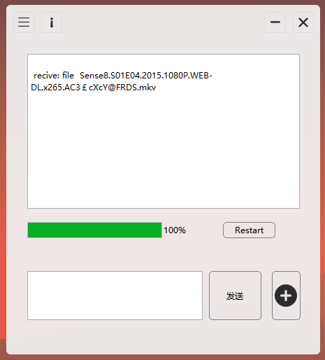
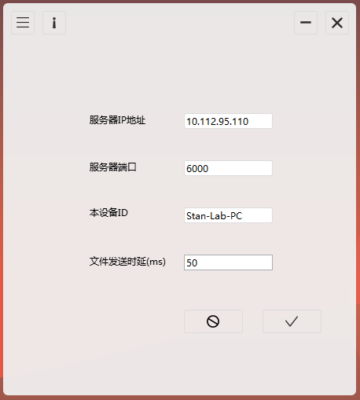

## README

这是一个局域网内文件传输和短消息传输工具

工具包内包含了数个版本的客户端，以及一个ip server。其中ip服务器负责向各用户提供ip服务，每个客户端在工作的工程中均会首先向服务器汇报自己的ip地址，同时从ip服务器获取其他用户的ip地址。用户在得到ip之后将会直接在两个需要通信的客户端建立tcp连接，用户之间直接通过socket以tcp协议完成短消息和文件的收发。

### 文件内容

项目包含以下文件夹：

~~~
------build
    |
    --command line
    |
    --ip server
    |
    --ipad
    |
    --iphone
    |
    --Qt source code

~~~

- build文件夹提供最新版本的windows客户端，已完成编译
- command line文件夹提供一个命令行版本的工具，基于python3，用户需安装python3。同时提供了一个适用于windows的注册表，运行该注册表，将在用户的右键菜单添加复制当前文件路径功能，以便于文件的传输。
- ip server文件夹提供两个版本的ip服务器，分别是python命令行版本，和exe版本，前者需要python3环境，后者直接双击运行即可。使用者可自由选择。
- ipad文件夹提供适用于9.7英寸iPad的客户端，客户端为纯python版本，运行需要依赖iOS应用：Pythonista。提供了ui界面，以及共享菜单内运行功能。主文件是`File_transfer.py`
- iphone文件夹提供了适用于4英寸iPhone的客户端，同样依赖Pythonista，功能与文件构成类似于ipad版本。
- Qt source code文件夹提供了最新版本windows客户端的Qt源码

备注：之所以说两个iOS的客户端只适用于特定尺寸的设备是因为ui是专门为这种尺寸的设备设计的，感觉`Pythonista`的ui设计工具虽然不错，但似乎有些问题，也许是我用的不熟吧。。。

### 使用方法

这个工具只能在只适用于可直接通信的网络环境中的两个客户端之间，例如两个设备处于同一局域网内，或者同时处于公网。

ip服务器是必须的，它提供了设备之间互相发现的功能。用户应该首先运行ip服务器，服务器运行之后会首先给出自己所在的ip地址，以及工作端口。然后用户可以开始运行各客户端，在客户端的设置页面或者conf配置文件中填写ip服务器的ip地址和端口号。为方便起见，建议用户设置本设备的ID。

客户端的使用基本上遵循这样的流程：选择通信的对象，进入通信界面，开始通信。

选择通信对象之后，本客户端和对方的客户端会同时自动跳入通讯界面。

iPad与iPhone客户端可以通过文件夹窗口选择要传输的文件；命令行版本默认处于消息传输功能中，输入file，回车，进入文件传输功能，应该手动输入文件路径，或者直接粘贴使用右键菜单复制的文件路径；Qt版本支持直接拖拽文件进入界面和点击`+`选择文件的功能，已选择的文件路径会被自动填入消息输入框，点击发送即可，取消发送当前已选择的文件只需修改消息输入框的内容即可。

Qt版本在通信界面提供了`restart`功能，可以在不关闭应用的情况下重启通信。

特别的，针对Qt客户端，可能需要重新设置文件发送时延，发送时延应该与当前网络环境的网络带宽相匹配。一个合适的时延将不会在任务管理器中观察到客户端的内存占用持续上升。以`10MB/s`的网络带宽为参考，合适的时延应该是`50ms`。如果时延设置过小，将会在传输过大文件的过程中导致内存占用持续上升，当内存占用超过1GB时，客户端随时可能崩溃。

所以，从性能来讲，客户端的文件传输速度至多达到网络带宽上限。所以在传输大型文件的时候速度也不要希望能有多快。为避免过长的等待，以`10MB/s`的网络环境为例，`2GB`大小的文件大概是一个比较合理的建议尺寸上限。当然，只要网络带宽够大，传输时延设置合理，客户端并不会限制传输文件的大小(只要你愿意等)。

另外，Qt客户端使用时需要build文件夹下的所有文件，接收到的文件将自动储存在这个文件夹下的`inbox`文件夹中

### 未来

接下来，会继续进行功能的优化以及Qt客户端的美化，升级。未来还可能提供基于Kotlin的安卓客户端，以及基于Swift的iOS客户端.....

### 更新记录

`18.7.11`

提供一个新的版本，大概也是近期的最后一个版本了。这个版本修复了几个bug，同时也提供了几个新的功能。这个版本的使用细节见上述使用说明部分。

这个版本同样存在着很多的问题，当然也有很多似乎应该加上的功能，因为各种各样的原因没能加上，通信界面的美化调整估计也要遥遥无期了。

最新版本的源码处在一个十分混乱的状态，充斥着大量因为设计失误而没有必要存在的标志位，信号，槽，还有很多测试中使用的qDebug输出未注释掉，总之源码的状况相当糟糕。但是一般情况下，客户端应该不会出太大的问题。

意识到文件传输速度绝对不会超过网络带宽这个显而易见的事实之后，我受到了一些打击，感觉很难忍受如此慢的速度。所以，工具的功能定位大概要改一改了，改成什么呢？无惧网络环境，一般不断线？。。。大概也不见得吧。总而言之，这个工具似乎愈发的鸡肋了，可能只对我自己有意义吧。

`19.10.21`

竟然已经一年多了!!!长久以来,我其实挺依赖这个工具的, 使用频率还是相当高的. 但是现在, 我发现原本的设计存在相当多的问题, 在线设备的维护和更新存在相当严重的问题, 无论是服务器和客户端. 

(Ps. 其实我很怀疑离开学校之后, 我是不是还会依赖它, 毕竟, 我在学校的时间也只有几个月了)

最近在某些方面遭遇了非常严重的挫折和打击, 给自己找点事情忙一下, 也许可以转移一下注意力, 可能会感觉稍微好一点. 

今天, 我重新设计了IP服务器, 增加了若干新的特性, 例如设备生存周期, 信息存储结构, 工作流程, select等等, 基本上, 现在的IP服务器问题是比较少的, 比以前合理蛮多的.

但是, 现在, 问题主要在于客户端, 平心而论, 三种客户端的设计都存在非常多的问题, 例如工作协议和新的IP服务器不匹配, 都需要大量的修改. 然后另外一个非常糟糕的问题是, 三个客户端的代码设计都是一团乱麻, 几乎需要重写一遍, 我现在感觉有点头皮发麻, 都没信心能够完成.

问题:

~~~
ios 上面, 关闭UI似乎并无法彻底关闭socket, 然后服务器根本收不到断开的信息
~~~

19.10.26

最近一段时间，我每天都会上好几个小时处理这个工具的问题， 包括ip服务器和Qt客户端。主要准备做的东西是对于通信协议及通信流程做一些调整， 但是现在ip服务器还没有调整好，依旧小毛病不少，偶尔也会导致错误无法捕捉而崩溃，总之还不能使用。因为协议的调整幅度不算大，所以旧有的客户端实际上也能在新的服务器上工作， 但是缺陷就是新增特性几乎完全无效了。

对于客户端的修改是一个比较棘手的问题，因为相比服务器，具有GUI的客户端设计更为复杂，并且包含了Qt和python两套代码，旧有的设计都非常混乱，代码的组织以及信号传输体系也非常混杂。

现阶段我基本将Qt客户端重写了一遍，架构也基本重新设计了，现在包含了IP_Handler, TCP_Server和TCP_Client，以及Controller和UI五个大部分， 将信号与槽重新精简规范了一遍， 同时逻辑与界面分离设计，Controller统一接管通信逻辑，简化和界面之间的通信, 额外也提供了一个日志体系。这样，为后期将C++的UI设计全面转换为QML设计打下了基础，后期界面的美化与改版可能也会方便一些(虽然我还不知道怎么结合C++和QML), 但是现在新的客户端还无法使用, 因为组件之间的配合我还没有搞定, 各种小毛病也很多.